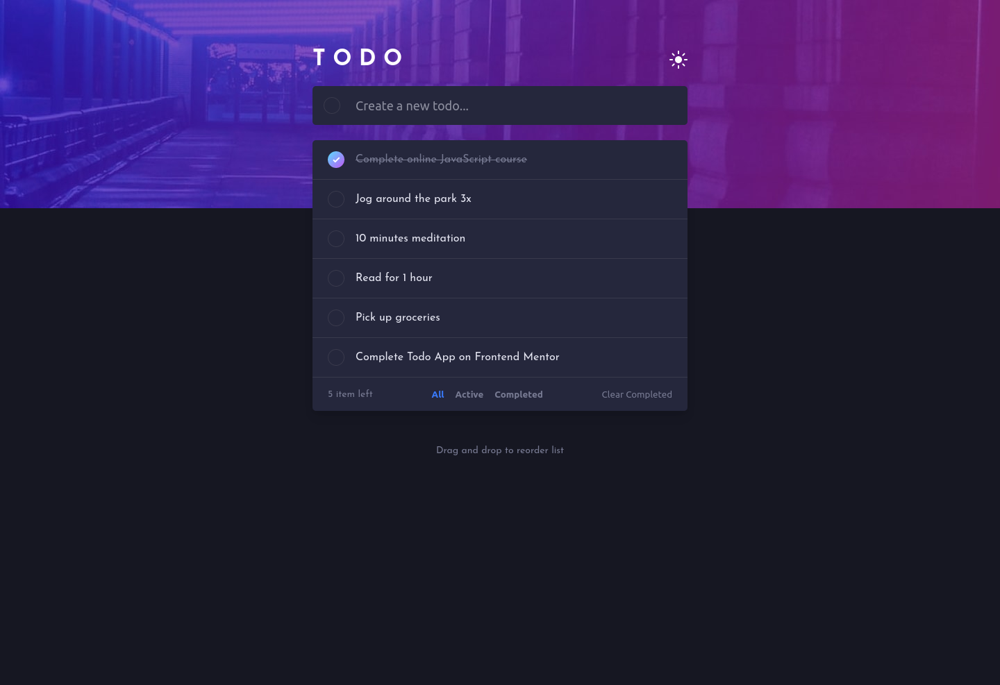
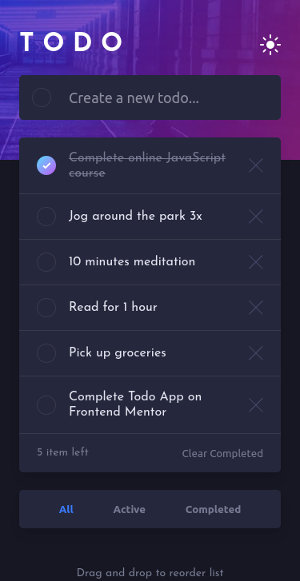

# Frontend Mentor - Todo app solution

This is a solution to the [Todo app challenge on Frontend Mentor](https://www.frontendmentor.io/challenges/todo-app-Su1_KokOW).

## Table of contents

- [Overview](#overview)
  - [The challenge](#the-challenge)
  - [Screenshot](#screenshot)
  - [Links](#links)
- [My process](#my-process)
  - [Built with](#built-with)
- [Author](#author)

---

## Overview

### The challenge

Users should be able to:

- View the optimal layout for the app depending on their device's screen size
- See hover states for all interactive elements on the page
- Add new todos to the list
- Mark todos as complete
- Delete todos from the list
- Filter by all/active/complete todos
- Clear all completed todos
- Toggle light and dark mode
- **Bonus**: Drag and drop to reorder items on the list

### Screenshot

  
Desktop

  

  
Mobile

  

### Links

- Solution URL: [Github Repo](https://github.com/lewis785/vue-todo-app)
- Live Site URL: [GitHub Pages](https://lewis785.github.io/vue-todo-app/)

---

## My process

### Built with

- Semantic HTML5 markup
- SCSS
- Flexbox
- [Vue](https://vuejs.org/) - JS library
- [Vue Draggable](https://github.com/SortableJS/Vue.Draggable) - Vue plugin for drag and drop

---

## Author

- Frontend Mentor - [@yourusername](https://www.frontendmentor.io/profile/lewis785)
